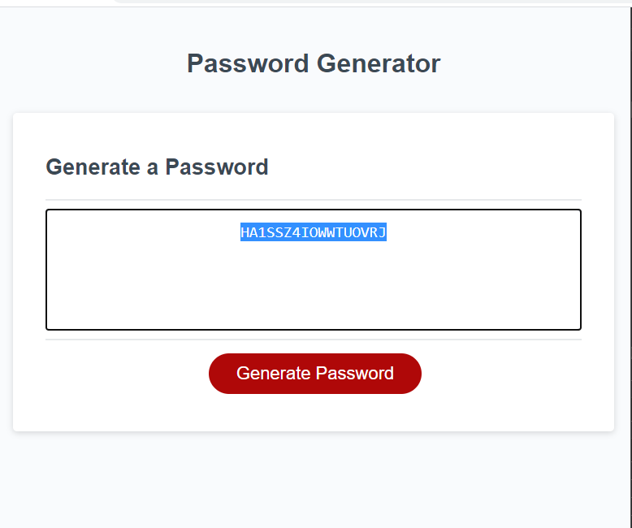

# Password Generator Starter Code

## Purpose
Create javascript code for a site that helps generate passwords after asking users a series of prompts. Password needs to be between 8 and 128 characters and contain at least 1 of the following; uppercase letters, lowercase letters, numbers, and special characters. 

"AS AN employee with access to sensitive data
I WANT to randomly generate a password that meets certain criteria
SO THAT I can create a strong password that provides greater security"

## Built With
* Starter Code!
* HTML
* CSS
* Javascript 

## Website

GitPages Deployed URL : https://clhurlbut.github.io/Password_Generator/

Github Repository URL : https://github.com/clhurlbut/Password_Generator

## Screenshot

## Contribution
Made in part with :potato: by Cassie Hurlbut for UCLA Coding Bootcampe / Trilogy 

##### Thank you UCLA Coding Bootcamp / Trilogy! 

